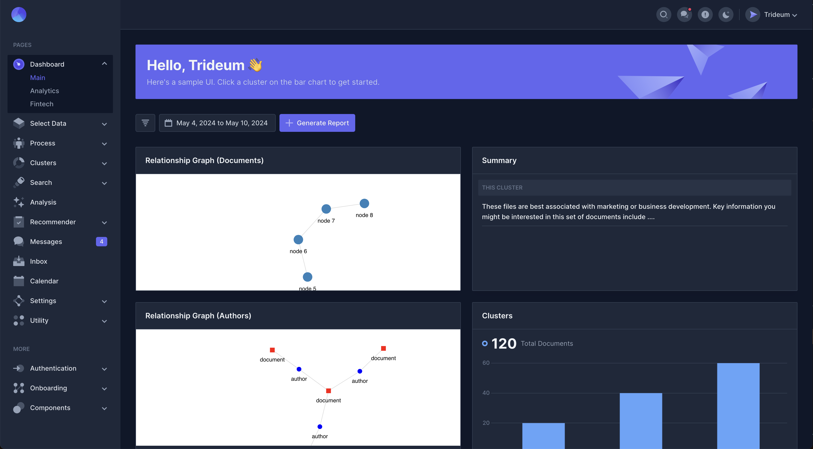

<h1 align="center">Trideum Sample</h1>

Sample UI for Trideum

## Table of Contents

1. [Description](#description)
   - [Built With](#built-with)
2. [Quick Start](#quick-start)
3. [Features](#features)
   - [Stateful Components](#stateful-components)
   - [Relationship Graphs](#relationship-graphs)

## **Description**

A sample UI built with Mosaic Lite with 2D relationship graphs.

### Built With
- [Mosaic Lite by cruip](https://github.com/cruip/tailwind-dashboard-template?tab=readme-ov-file#compiles-and-hot-reloads-for-development)
- [React Force Graph] (https://github.com/vasturiano/react-force-graph)
- [React](https://reactjs.org/)
- [Chart.js](https://www.chartjs.org/docs/latest/)

## Quick Start

Check out the deployed demo [here](https://trideum-sample.vercel.app/).

## Features

### Stateful Components

Cluster summary, similar authors and themes, and graphs change depending on the cluster chosen from the bar graph.

### Relationship Graphs

2D relationship graphs are fully interactable.
